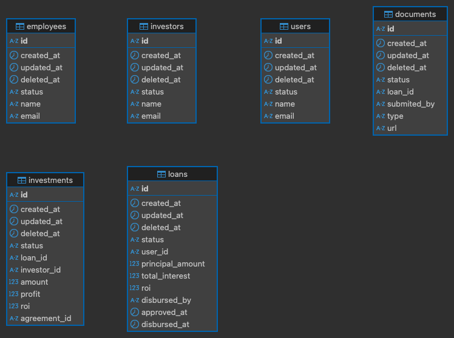

# loan-service
Amarth: Code test( with System design)

# Step to run app

- Clone the repo
- `go mod tidy`
- `go mod vendor`
- `go run main.go`
- `go test .`

# Important Note:
- Test added only for service package

# All tables

